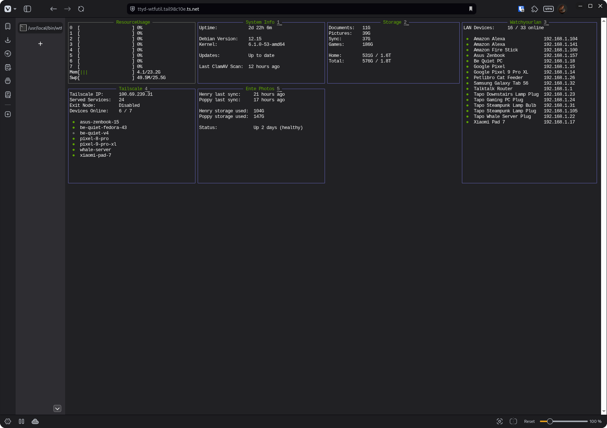

# Wtfutil TUI

## Overview

This is a custom configuration to set up a Wtfutil TUI home server dashboard, made accessible on the browser via Ttyd.



## Setting up the TUI

### Pre-Requisites

This README assumes that you are using Linux with Systemd. If you are not, you may need to adjust some parts of these instructions.

### Installing Wtfutil

1. Go to https://github.com/wtfutil/wtf/releases and find the latest release.

2. Download or use ` wget ` to pull the latest release.

3. Unzip or use ` tar -xzf ` on the latest release.

4. Add it to your path with ` sudo ln -s ./wtfutil /usr/local/bin/wtfutil `.

5. Confirm that this has worked by running ` which wtfutil `.

6. Open ` wtfutil ` to see the default config.


### Installing Ttyd

1. Go to https://github.com/tsl0922/ttyd/releases and find the latest release.

2. Download or ` wget ` the latest Ttyd release.

3. Copy or link the file to "/usr/local/bin/ttyd" in the same way as you did for Wtfutil.

4. Create a new Systemd service with ` sudo vi /etc/systemd/system/wtfutil-web.service `.

5. Paste [wtfutil-web.service](systemd/wtfutil-wen.service).

6. Start the service with:

    ```bash
    sudo systemctl daemon-reload

    sudo systemctl enable --now wtfutil-web.service

    sudo systemctl status -l wtfutil-web.service
    ```

7. Check that you can acccess the TUI at http://<your-ip>:7681

### Customising the Config

Wtfutil expects there to be a custom config file at "~/.config/wtf/config.yaml". You can either edit this file, or create a symlink to another location.

Every time you write changes to the config file, Wtfutil should automatically reload.

### Custom Widgets

You can use any custom script within Wtfutil. You can see examples of this within my [config.yml](config/config.ym).

